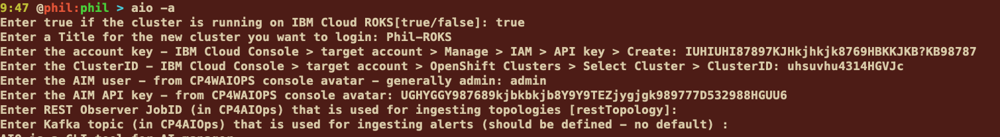
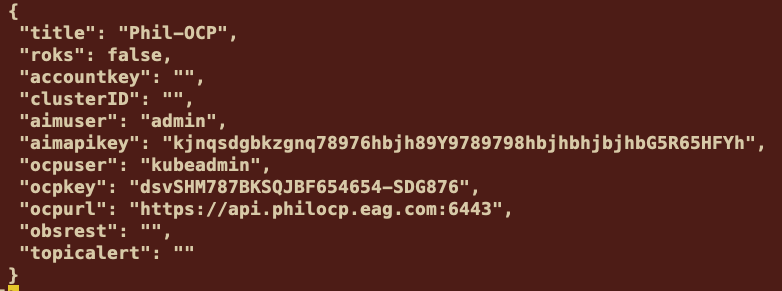
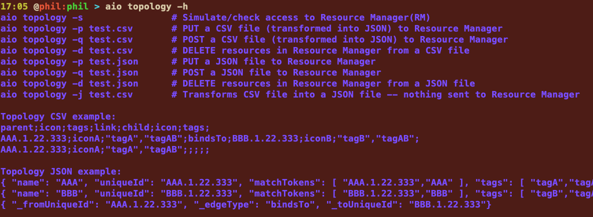
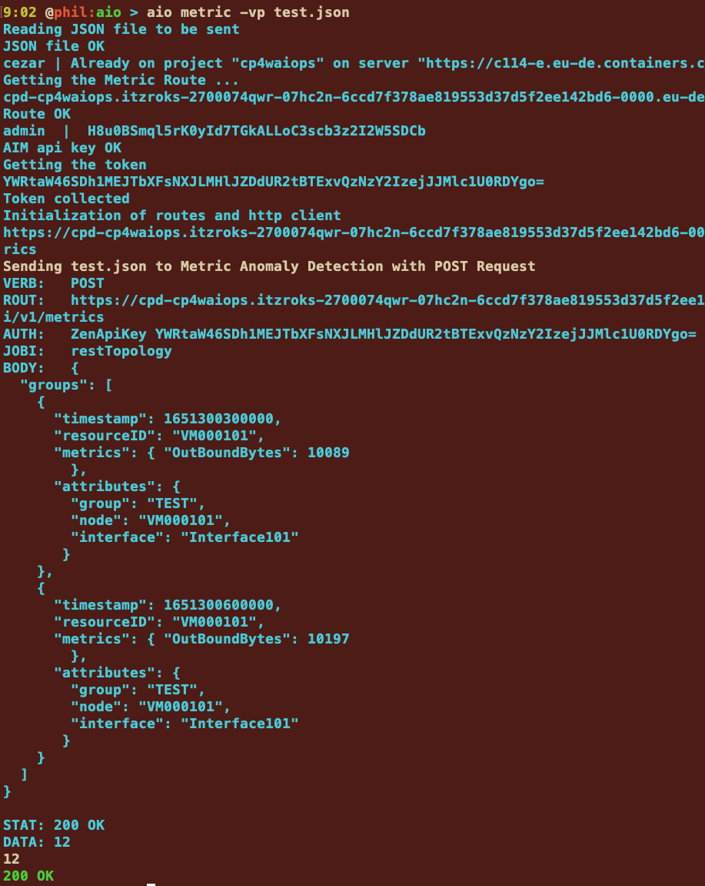
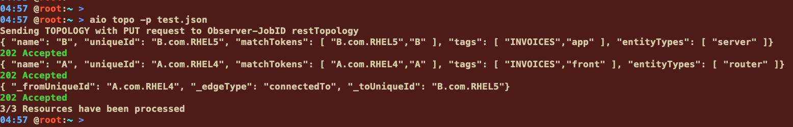
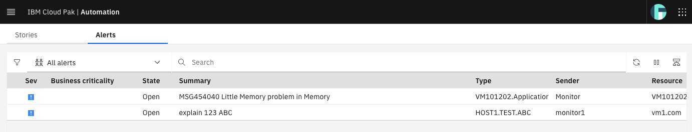
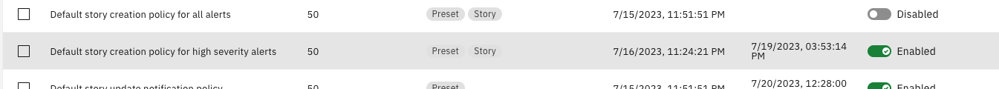

# aio CLI to manage CP4AIOps


## Table of Contents

---

0- aio CLI Installation 

1- Connecting and switching to any OpenShift with **aio** CLI 

2- Ingesting and managing metrics

3- Ingesting and managing topologies

4- Ingesting and managing events/alerts/stories

---

 

Note : in these version, I ported aio program to **MacOS**, **Linux** and **Windows**. 64 bits only. 


### Purpose 

The **aio** command line is a small program that helps you to log in, switch between openshift clusters and then **manage** CP4WAIOPS different data (metrics, topologies, events, stories ...). Logs are under implementation. The intend of this command is to provide a command line to help ingeneers to quickly view, ingest or delete data in CP4WAIOPS during tests, PoCs or MVPs. 


### Installation

Put the aio program into a binary library that is located in your PATH. For example for Linux or MacOS:

```
cp aio-linux-amd64 /usr/local/bin/aio
cd /usr/local/bin
chmod +x aio
```


You also need to have : **oc** CLI installed. Optionnaly **ibmcloud** if you defined a ROKS cluster on IBM Cloud. 


# 1- Connecting to any OpenShift with **aio** CLI  

When you have to manage multiple ROKS or OCP environments for managing different AI managers, it is not easy to remenbers users, passwords, account keys, API keys ... So I decided to write a small program called **aio** that will make your life better. 

Because I was switching from one ROKS or OCP to another one so many times during the day, I felt it was so painful to recall the credentials, I have decided to store all the credentials in a file (called .aio in your home directory) 

Also, the **first time,** you will type **aio** on your terminal, the **~/.aio** file is empty. So it will ask you to **add a new OpenShift cluster** set of credentials. 

The first step is to specify **true** (ROKS) or **false** (OCP) :


### IBM Cloud OpenShift Cluster (ROKS) configuration

(If you use a standard OCP see next section)

You should specify **true** for example if you have an OpenShift Cluster running on **IBM Cloud** and then the title is just a name that represents the cluster (you can pick **any name that you want**).


Then you need to provide the account API Key: you can find this key in the IBM Cloud console. Be sure to select the right target **account** (on the top right) where your cluster is located. If necessary, it is easy to **create a new key** by selecting `Manage > IAM > API Key > Create` . Don't forget to download the key and copy -paste the key when asked. If you already have that key, just provide the existing key.


You will need to provide an **Account key** (this key can be generated on IBM Cloud in the Manage > IAM > API key). Put this key when requested. 


Then you will be asked for the **clusterID** : this ID is provided in the IBM Cloud console, on the OpenShift Cluster of your choice.


Finally the 2 last parameters are optional if you don't have installed CP4WAIOps and concern the connexion to **AI Manager** (CP4WAIOPS). The **admin** or any other user necessary to connect to AI Manager. `admin` is generally the user's name that you will use. Of course, you can get the key once the AI manager has been created. 

You will be asked to provide the AI Manager API key (which is also optional) : to get this key just go to the top right icon (avatar) and click on settings > API Key. You can regenerate a new one if necessary.


Finally fill the jobID and the Topic if you know them at the time of configuration:



You can also visualize the **~/.aio** file and you can also modify it directly if needed. 


You can also type **aio -l** to list the different parameters.


### OCP configuration

If you are using an **OCP cluster,** instead of ROKS (false),  you will use the **ocpuser, ocpkey and ocpurl** parameters instead of **accountkey and clusterID.**  Depending on the the **roks=false**, this will enable to collect automatically these parameters.


Then provide  **title, ocpuser, ocpkey and ocpurl** parameters


Then the admin and API key for CP4WAIOPS (if known at the time of configuration - otherwise specify none):


Finally if you know the JobID and Kafka Topic, specify them. Otherwise press enter and specify these names later. 


You can also modify / print ~/.aio when you want:




### Using aio to select and login any OpenShift Cluster

I didn't implemented a delete parameter for aio CLI to delete a specific cluster entry. But you can manually edit .aio.

Now let's play with **aio**.When you just type aio, you will get the list of all your registred clusters (ROKS or OCP):  


You can just navigate to the Cluster (with cursors and the yellow pointer) that you want and press ENTER. I picked **cezar** for example then be patient, 10 or 20 seconds generally:

If successful, **aio** will display some information:


If not successful, you will receive a **red message**: 


> Remember that aio is using oc CLI and ibmcloud CLI (if using ROKS).

### Help

If you have some problems, you can use the help : `aio -h`


### Subcommand help

You can also ask for some help on specific topic like **topology** or **topo** by using `aio topo -h`



For instance, the **verbose** mode is very useful to find out a **connexion problem**. Verbose mode is used in conjonction with a subcommand and another flag (like `aio metric -vp` or `aio topo -vd` for example).


### Shortcuts

Each subcommand has also shortcuts like :

- alerts, alerts, a
- metrics, metric, m
- topologies, topology, topo, t
- stories, story, s


# 2- Ingesting metrics  

When you want to ingest some metrics to the Metric Manager in CP4AIOps, you need to take care about a lot of informations like credentials, REST APIs, routes, password ...

So to avoid all these problems, you can use **aio metric** subcommand that encapsulates all this complexity into the aio CLI.

You can start with `aio metric -h` to see the program help. Be sure to be connected. 


The current thing that we are doing, we can send a json file to the metric manager. This JSON file contains all the metric definitions that you need to ingest. In our case, we look at `OutBoundBytes` that corresponds to a network interface metric. 

Prepare a file call test.json with the following content:

``` 
{
  "groups": [
    {
      "timestamp": 1651300300000,
      "resourceID": "VM000101",
      "metrics": { "OutBoundBytes": 10089
        },
      "attributes": {
        "group": "TEST",
        "node": "VM000101",
        "interface": "Interface101"
       }
    },
    {
      "timestamp": 1651300600000,
      "resourceID": "VM000101",
      "metrics": { "OutBoundBytes": 10197
        },
      "attributes": {
        "group": "TEST",
        "node": "VM000101",
        "interface": "Interface101"
       }
    }
  ]
}
```

This JSON file will create 2 occurences of one metric for the same resource `VM000101`.

Now, you can use the following command to ingest the JSON content into Metric Manager:

```bash
aio metric -f test.json
```


In case of error, you can use the verbose mode  to look at the details by specifying the **-v** in the command line. The result will show all the different steps (token, routes, API ...):

```
aio metric -vp test.json
```




# 3- Ingesting and managing topologies 

When managing topologies with AI Manager, you also have to provide API keys and routes and REST APIs.

So to avoid this problem, you can use `aio topology` which help you to connect and send (and manage) REST API requests to the AI Manager in the Topology manager. 

> **Important** you must use **aio** to be connected to the cluster. Also provide the **AIM user and API key** with correct values. 


Use `aio topology -h` or `aio topo -h`  to see the help for this feature:


The first thing that we want to do with aio topo is to check that the routes and rest observers have been well defined on the AI manager. Use `aio topo -s`  to check the **info service is OK** or not. See below a good example where you didn't get a connection with the cluster :


> **IMPORTANT**: to ingest topologies with the REST API, we need to define a REST Observer in the Cloud Pak. The default name for this Observer is `restTopology` but you can also change that name in the aio configuration file. 

Once you checked that the cluster and  observers can be accessed with good credentials, you can use this program to ingest new topologies: there are 2 different ways : thru a JSON file or thru a csv file. 

Let's take a basic csv file containing (ab.csv): only one line but you can add several lines. 

```csv
A.com.RHEL4;router;"INVOICES","front";connectedTo;B.com.RHEL5;server;"INVOICES","app";
```

**A.com.RHEL4**: is the parent member, this long name will be the unique ID. A will be the **displayed** name (first part before the dot. If no dot in the file, the displayed name is the same as the unique ID). 

**router**: is the icon used for the A

**bindsTo**: is the relationship used between A and B

**server**: is the icon used for B

The other parameters are tags for each resource. You can have one or multiple tags separated by commas. 

Before sending that content, **aio** will translate that into a JSON content that will be used to be sent to the Topology manager.

To see the JSON content, type the following command:

```bash
aio topo -j test.csv
```


Now let's send this small topology to AI Manager:

```bash
aio topo -p test.csv
```


We created 3 resources (A and B and a connection) connected together with a **connectedTo** relationship. The **202 Accepted** return code is normally expected. 

Go to the AI manager console and look at Resource Management:


You can also delete the following resources with the following command:

```
aio topo -d test.csv
```


> **In case of error**: if you received a red message, you can use the verbose mode (**-vp** or **-vd**) to check what is going wrong.
>
> The connection (or edge or relationship) is automatically destroyed when the 2 resources have been suppressed. 


You can also ingest directly JSON file. Lets create a test.json by using the `-j`parameter:

```
aio topo -j test.csv > test.json
```

This will generate a file with the following content:

```
{ "name": "B", "uniqueId": "B.com.RHEL5", "matchTokens": [ "B.com.RHEL5","B" ], "tags": [ "INVOICES","app" ], "entityTypes": [ "server" ]}
{ "name": "A", "uniqueId": "A.com.RHEL4", "matchTokens": [ "A.com.RHEL4","A" ], "tags": [ "INVOICES","front" ], "entityTypes": [ "router" ]}
{ "_fromUniqueId": "A.com.RHEL4", "_edgeType": "connectedTo", "_toUniqueId": "B.com.RHEL5"}
```

This content is re-creating the 2 servers (A and B) and a connection between them. 

Use the following command to send that file to the Topology Manager:

```
aio topo -p test.json
```




If you go to the AI Manager Console > Resource Manager :


# 4- Ingesting events and alerts  


In that case, we want to send some events or alerts to the Cloud Pak. You need to define a **KAFKA connector** in the Cloud Pack web console. Let call this Kafka connector **events**


You must get the Kafka topic in the connector **definitions**:


Take a note of the **topic**:


In that case, the topic is :

``` http
cp4waiops-cartridge-alerts-none-iogxgrgs
```

You can also define this topic in the **.aio** file to be used by aio. 

```bash
cat ~/.aio
```


**If this topic is not specified,** then aio will search for the first `*-alerts-none*` topic in the Kafka topic list. 

Use the help to get the instruction to list or ingest alerts:

```
aio alert -h
```


There are different ways to ingest alerts. The quick way that can be used is especially to check the Kafka topic is fine:

- VM101202 is a resource name;
- 3 is a severity
- MSG454040 Little Memory problem in Memory   is a summary message

Let's start with a quick event:

```bash
aio alert -q 'VM101202,3,MSG454040 Little Memory problem in Memory'
```


Then you can go to the Cloud Pak web console and look at the alerts:


Let's try another way : using a JSON payload that contains almost all the necessary parameters.

Let's prepare a JSON payload :

```http
'{"sender": {"service": "Agent", "name": "monitor1","type": "App"},"resource": {"name": "vm1.com","hostname": "vm1","type": "IBM","ipaddress": "192.1.1.109","location": "Paris"},"type": {"classification": "HOST1.TEST.ABC","eventType": "problem"},"severity": 3,"summary": "explain 123 ABC","occurrenceTime": "2023-07-20T11:17:13.000000Z","expirySeconds": 0}'
```

Don't forget to modify the **occurenceTime** with an updated **date**. 

Now use the following command:

```
ai alert -s '{"sender": {"service": "Agent", "name": "monitor1","type": "App"},"resource": {"name": "vm1.com","hostname": "vm1","type": "IBM","ipaddress": "192.1.1.109","location": "Paris"},"type": {"classification": "HOST1.TEST.ABC","eventType": "problem"},"severity": 3,"summary": "explain 123 ABC","occurrenceTime": "2023-07-20T11:17:13.000000Z","expirySeconds": 0}'
```


Then look to the Cloud Pak web console: 



Now if we want to generate a story, let us go to the polocies :

```
Menu > Operate > Automations > Policies 
```


Activate the `Default story creation policy for high severity alerts`




We must trigger a severity 5 or 6 alert to generate a story:

```bash
aio alert -q 'VM101303,5,CRITICAL 1089 : HARDWARE SERIOUS ISSUE : Temperature is very high on that server'
```


You can look to the alert list:

```
aio alert -l 
```


or 


or you can also look at the stories:


or 

```
aio stories -l
```


Then you can delete all the alerts (it takes 2 minutes to complete) after a short answer: 

```
aio alerts -d
```


# Conclusion 

With this tool you can switch from one cluster to another one easily, you can ingest new files into the metric manager or define new topologies on an easier way and ingest new alerts. 


Thanks.

---

 
